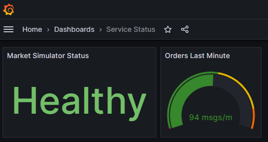

Start the `http` Launch Configuration of the Aspire Host `Agora.AppHost` which will automatically open the Aspire Dashboard

Afterwards you can start Prometheus and Grafana 
```shell
docker-compose up -d
```

Open `localhost:3000` within the browser and login to Grafana

