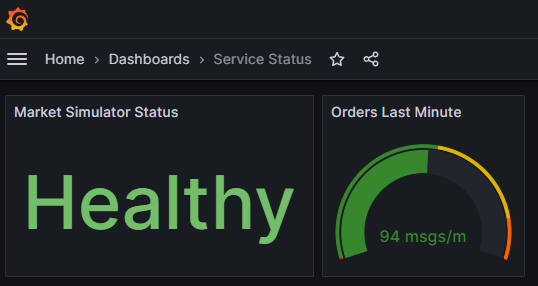

# Getting Started

### Prerequisites

- Aspire

### Setup HTTPS with a development certificate

If not existing already create a development certificate via .Net CLI
```shell
dotnet dev-certs https -ep $env:USERPROFILE\.aspnet\https\aspnet-cert.pfx -p <password> --trust
```

Set the password of the newly created development certificate as a user secret
```shell
dotnet user-secrets -p Agora.Simulator\Agora.Simulator.csproj set "Kestrel:Certificates:Default:Password" "<password>"
```
### Run the project

Run the dotnet project
```shell
aspire run     
```

Afterwards you can start Docker compose stack to run prometheus and grafana
```shell
docker-compose up -d
```

### Take a look at the Grafana dashboard

Open `localhost:3000` within the browser and login to Grafana

